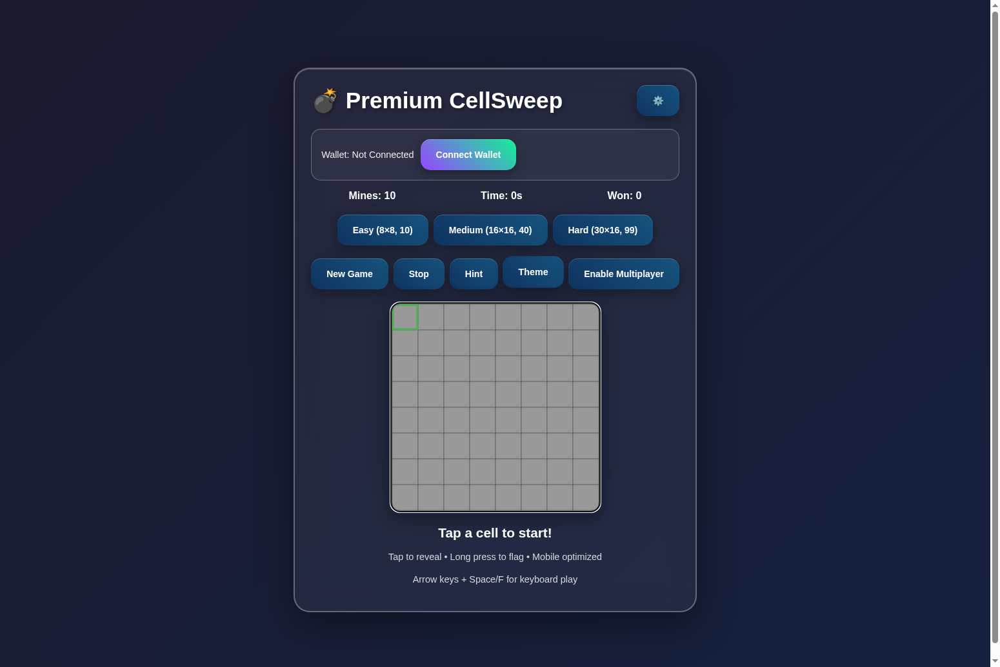

# 💣 CellSweep

**A blockchain-powered reinvention of the classic Minesweeper game with Solana integration**

CellSweep transforms the beloved Minesweeper into an exciting Web3 experience where players pay entry fees in SOL, and each move has a cost — creating real tension with every click. Winners earn a share of the total prize pool, combining skill, strategy, and luck in a competitive decentralized environment.



## 🎮 Features

### Core Gameplay
- **Classic Minesweeper Mechanics** - Reveal cells, flag mines, clear the board
- **Multiple Difficulty Levels** - Easy (8×8), Medium (16×16), Hard (30×16)
- **Mobile Optimized** - Touch controls with long-press flagging
- **Keyboard Support** - Arrow keys + Space/F for desktop play

### Blockchain Integration
- **Solana Wallet Support** - Phantom and Solflare wallet integration
- **Real SOL Betting** - Entry fees and move costs in SOL cryptocurrency
- **Multiplayer Rooms** - 2-4 player competitive games
- **Progressive Betting** - Different room types with varying stakes

### Visual & UX
- **4 Beautiful Themes** - Default, Dark, Neon, and Cyberpunk
- **Particle Effects** - Explosions, celebrations, and visual feedback
- **Achievement System** - Track wins, investments, and progress
- **Responsive Design** - Works perfectly on desktop and mobile

## 🚀 Quick Start

### Play Online
Visit the live demo: [https://inandenizturk.github.io/CellSweep/](https://inandenizturk.github.io/CellSweep/)

### Run Locally
1. Clone the repository:
   ```bash
   git clone https://github.com/inandenizturk/CellSweep.git
   cd CellSweep
   ```

2. Start a local server:
   ```bash
   npm start
   # or
   python3 -m http.server 8000
   ```

3. Open your browser to `http://localhost:8000/src/CellSweep.html`

## 🎯 How to Play

### Single Player Mode
1. Select difficulty level (Easy, Medium, Hard)
2. Click any cell to start the game
3. Use numbers to identify mine locations
4. Flag suspected mines with right-click (or long-press on mobile)
5. Clear all non-mine cells to win!

### Multiplayer Betting Mode
1. **Connect Wallet** - Click "Connect Wallet" and approve connection
2. **Create/Join Room** - Choose room type based on your experience level
3. **Pay Entry Fee** - Each player pays the room's entry fee in SOL
4. **Take Turns** - Players alternate moves, each costing additional SOL
5. **Win the Pot** - Winner takes the majority of the accumulated prize pool

### Room Types
- **Starter Room** (0.0031 SOL entry) - 2 players, 70% winner payout
- **Advanced Room** (0.0062 SOL entry) - 3 players, 65% winner + 15% runner-up
- **Expert Room** (0.0124 SOL entry) - 4 players, 60% winner + 20% runner-up

## 📁 File Structure

```
CellSweep/
├── src/
│   ├── CellSweep.html          # Main game with SOL betting
│   ├── solana.html             # Nosana (NOS) token version
│   ├── minegrid.html           # Alternative branding
│   ├── minegrid-competition.html    # Competition variant
│   └── minegrid-progressive-fixed.html  # Progressive betting variant
├── docs/                       # Documentation
├── screenshots/               # Game screenshots
├── .github/workflows/         # GitHub Actions
├── README.md                  # This file
├── LICENSE                    # MIT License
├── CONTRIBUTING.md           # Contribution guidelines
└── package.json              # Project metadata
```

### Game Variants

- **CellSweep.html** - Primary version with SOL cryptocurrency integration
- **solana.html** - Nosana (NOS) token version with different branding
- **minegrid*.html** - Various branded versions with different features and styling

## 🔧 Technical Details

### Technologies Used
- **Frontend**: Pure HTML5, CSS3, JavaScript (ES6+)
- **Blockchain**: Solana Web3.js library
- **Wallets**: Phantom, Solflare integration
- **Graphics**: HTML5 Canvas with particle effects
- **Responsive**: CSS Grid and Flexbox

### Key Components
- **Game Engine** - Core minesweeper logic and rendering
- **Wallet Manager** - Solana wallet connection and transaction handling
- **Multiplayer System** - Room management and turn-based gameplay
- **Particle System** - Visual effects for explosions and celebrations
- **Progress Tracking** - Achievement system with localStorage persistence

## 🎨 Themes

CellSweep includes 4 stunning visual themes:

1. **Default** - Clean gradient with professional styling
2. **Dark** - Sleek dark mode with blue accents
3. **Neon** - Vibrant cyberpunk-inspired colors
4. **Cyberpunk** - Matrix-style green on black

## 🔐 Wallet Integration

### Supported Wallets
- **Phantom** - Most popular Solana wallet
- **Solflare** - Feature-rich Solana wallet

### Security Features
- **No Private Key Storage** - Wallets handle all cryptographic operations
- **Transaction Approval** - Users approve each transaction
- **Balance Verification** - Automatic balance checks before moves
- **Secure Connection** - HTTPS required for wallet operations

## 🚀 Deployment

### GitHub Pages (Automatic)
The repository is configured for automatic deployment to GitHub Pages on every push to the main branch.

### Manual Deployment
1. Build the project (if needed):
   ```bash
   npm run build
   ```

2. Deploy to GitHub Pages:
   ```bash
   npm run deploy
   ```

### Custom Domain
Update the `cname` field in `.github/workflows/deploy.yml` to use your custom domain.

## 🤝 Contributing

We welcome contributions! Please see [CONTRIBUTING.md](CONTRIBUTING.md) for guidelines.

### Development Setup
1. Fork the repository
2. Create a feature branch
3. Make your changes
4. Test thoroughly
5. Submit a pull request

## 📄 License

This project is licensed under the MIT License - see the [LICENSE](LICENSE) file for details.

## 🙏 Acknowledgments

- Inspired by the classic Minesweeper game
- Built on the Solana blockchain
- Uses Solana Web3.js library
- Designed for the Web3 gaming community

## 📞 Support

- **Issues**: [GitHub Issues](https://github.com/inandenizturk/CellSweep/issues)
- **Discussions**: [GitHub Discussions](https://github.com/inandenizturk/CellSweep/discussions)
- **Email**: [inandenizturk@gmail.com](mailto:inandenizturk@gmail.com)

---

**Ready to play?** [Start CellSweep now!](https://inandenizturk.github.io/CellSweep/src/CellSweep.html) 🎮💣
